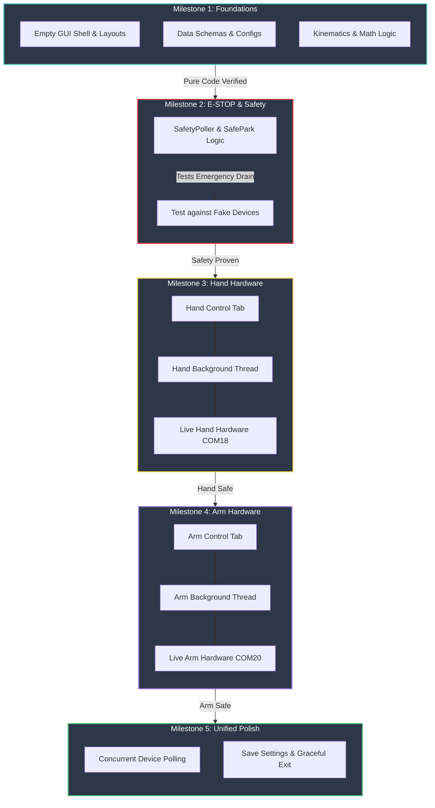

# 01 — Unified Manual Control GUI (`arm101-gui`)

> **Status:** Approved 2026-05-06; revised 2026-05-06 (arm keyboard jogging + safe-park-before-disable).
> **Owner:** Claude (drafted) → user (sign-off).
> **Supersedes:** none.
> **Implements:** new console-script `arm101-gui`.
> **Iron Laws touched:** IL-1, IL-2, IL-3, IL-4, IL-5, IL-6, IL-7 (see §3).

This is the canonical spec for the unified PySide6 desktop GUI that controls the SO-ARM101 follower arm and the AmazingHand bionic hand from one Python process. After implementation lands, this document remains the authoritative reference for design intent (per IL-7 / `06-documentation-protocol.md`).

---

## Decisions log (recap from interview)

| # | Question | Decision |
|---|---|---|
| Q1 | UI framework | **PySide6 (Qt6, LGPL)** |
| Q2 | Layout | **Tabbed** — Hand tab, Arm tab, shared header (status + E-STOP + activity log) |
| Q3 | Hardware interface | **lerobot for arm + rustypot wrapper for hand**, two device objects, no extra libraries |
| Q4 | E-STOP hotkey | `Esc`, plus always-visible red button |
| Q4 | Safety poller | Enabled by default, **1 Hz** |
| Q4 | Auto-disable temp threshold | **Yes**, threshold 65 °C (5 °C margin under manufacturer trip ~70 °C) |
| Q5 | Hand finger naming | **Ring / Middle / Pointer / Thumb** (matches keyboard mapping `1`–`4`) |
| Q5 | Hand speed scale | **1–5** integer, default 3, per-finger + global sync |
| Q6 | Hand slider math | **Calibration-aware (Option B)** — degrees relative to each servo's `middle_pos` |
| Q7 | Arm features | All seven items (sliders, readback, per-joint torque, global velocity, 3 quick poses, save/load) |
| Q7 | Arm pose file | Separate `data/arm_config.yaml`, no shared discriminator |
| Q7 | Arm keyboard | **Yes** — per-motor jogging modeled on the hand panel (`1`–`5` select, arrows step, `T` torque-toggle). See §6.3. |
| Q8 | Persistence | **Three YAMLs** — `data/app_config.yaml`, `data/hand_config.yaml`, `data/arm_config.yaml` |
| Q8 | Connection | **Connect-on-demand** per device, independent (matches IL-1), torque-off on exit |
| R1 | E-STOP / critical-temp behavior | **Safe-park then disable** by default (route to a safe pose before cutting torque, to keep the wrist + hand from dropping). `Shift+Esc` = hard kill that skips the park step. See §7.5. |

---

## Table of contents

1. [Goal](#1-goal)
2. [Non-goals](#2-non-goals-explicitly-out-of-scope-for-v1)
3. [Iron Law touchpoints](#3-iron-law-touchpoints)
4. [Architecture](#4-architecture)
5. [Hand subsystem](#5-hand-subsystem)
6. [Arm subsystem](#6-arm-subsystem)
7. [Safety subsystem](#7-safety-subsystem)
8. [Persistence](#8-persistence)
9. [Module breakdown](#9-module-breakdown-full-file-list)
10. [`pyproject.toml` deltas](#10-pyprojecttoml-deltas)
11. [Testing strategy](#11-testing-strategy-per-04-testing-verificationmd)
12. [Out-of-scope / future work](#12-out-of-scope--future-work-not-v1)
13. [Directory layout](#13-directory-layout)
14. [Open issues / risks](#14-open-issues--risks)
15. [Appendix — Decision rationale](#15-appendix--decision-rationale)

---

## 1. Goal

A single PySide6 desktop application — invoked via `uv run arm101-gui` — for **manual, mouse-and-keyboard-driven control of the SO-ARM101 follower arm and the AmazingHand bionic hand from one Python process**. Used for bring-up, demos, debugging, pose authoring, and sequence playback. Not a teleop pipeline, not a policy runner.

## 2. Non-goals (explicitly out of scope for v1)

- Live telemetry charts (matplotlib graphs from AmazingHandControl) — dropped
- Mimic mode / left-hand mirroring — dropped
- Arm sequences — hand sequences only
- Camera feed integration — none
- Dataset recording / replay — none
- Right hand or second hand — only the right AmazingHand we have
- Windows MSI / packaging — runs from `uv run`
- Cross-platform validation — Windows 11 only (the only host)

## 3. Iron Law touchpoints

| IL | How this spec honors it |
|---|---|
| IL-1 | Two independent COM ports, two independent connection states. GUI never assumes both PSUs are on. Voltage warnings if a bus reads outside ±5 % of nominal (suggests wrong PSU swapped). |
| IL-2 | `references/AmazingHandControl/hand_logic.py` is **not imported** — pure-logic functions we need (`validate_name`, `clamp`, `compose/decompose`) are **transferred** into `src/arm101_hand/hand/kinematics.py` with citation in the docstring. No `pip install -e references/AmazingHandControl`. |
| IL-3 | Hand IDs 1–8 (paired by finger), arm IDs 1–5 (no ID 6). The GUI's "Pointer" label maps to schema id `index = (1,2)` for any YAML it writes — so calibration files stay canon-compliant. |
| IL-4 | Single owner per bus. Safety poller and command path go through one `QThread` per device. Lock files are not used (Windows doesn't enforce them on COM); we rely on the OS's exclusive open. |
| IL-5 | All persisted state (`data/*.yaml`) is in-tree. No file is written outside the workspace at runtime. |
| IL-6 | This is one cross-device feature → one PR, all GUI files in one commit (or split into ≤ 6 logical commits per `05-git-workflow.md`). |
| IL-7 | This spec is the canonical home. `CLAUDE.md` and `README.md` get pointer links only — no inline restatement. |

## 4. Architecture

### 4.1 Three-layer mapping

```
                  application layer  (src/arm101_hand/gui/, src/arm101_hand/scripts/unified_gui.py)
                        │
                        ▼
                    device layer  ──────────────────────────
                   /                                         \
   src/arm101_hand/hand/controller.py        src/arm101_hand/robots/so101_follower_no_gripper.py
   (HandController, wraps rustypot)          (SO101FollowerNoGripper, wraps lerobot)
                   \                                         /
                    ▼                                       ▼
                  primitive layer  (src/arm101_hand/config/, src/arm101_hand/hand/kinematics.py)
                  pydantic schemas, pure math, validation — zero hardware contact
```

Per `01-module-layering.md`: no upward imports, no cross-device device imports, hardware never opens at import time.

### 4.2 Threading model

```
┌──────────────────────────────────────────────────────────────┐
│              Main / UI thread  (Qt event loop)               │
│  - Widget updates only                                       │
│  - Reads current values from controllers via queued signals  │
│  - Dispatches commands via queued signals                    │
└────┬─────────────────┬──────────────────┬────────────────────┘
     │                 │                  │
     ▼                 ▼                  ▼
┌─────────┐      ┌─────────┐      ┌──────────────┐    ┌─────────────┐
│  Hand   │      │  Arm    │      │   Safety     │    │  Sequence   │
│ thread  │      │ thread  │      │   poller     │    │   player    │
│         │      │         │      │   thread     │    │   thread    │
│ owns    │      │ owns    │      │              │    │             │
│ rustypot│      │ lerobot │      │  1 Hz reads  │    │ walks pose  │
│ port    │      │ port    │      │  V, T from   │    │ sequence,   │
│         │      │         │      │  both ctrls  │    │ enqueues    │
└─────────┘      └─────────┘      └──────────────┘    │ commands    │
                                                      └─────────────┘
```

- All inter-thread communication: Qt **queued signals** (thread-safe, FIFO).
- No shared mutable state between threads. No `threading.Lock` (signals enforce ordering).
- E-STOP shortcut posts a single `disable_torque_all()` call to **both** device threads (queued, but the threads have a high-priority signal slot for E-STOP that drains pending command queue first — see §7.3).

### 4.3 GUI shell layout

```
╔══════════════════════════════════════════════════════════════════╗
║ Hand: ● COM18 5.02 V  46 °C max     Arm: ○ Disconnected   ⛔ E-STOP ║   header (always visible)
╠══════════════════════════════════════════════════════════════════╣
║ ┌─────────────────────┬──────────────────────┐                    ║
║ │      Hand           │       Arm            │   tab bar          ║
║ ├─────────────────────┴──────────────────────┤                    ║
║ │                                            │                    ║
║ │     (active tab content)                   │                    ║
║ │                                            │                    ║
║ ╞════════════════════════════════════════════╡                    ║
║ │  Activity log  (collapsible, 8 lines tall) │                    ║
║ └────────────────────────────────────────────┘                    ║
╚══════════════════════════════════════════════════════════════════╝
```

- Header (status badges + E-STOP) is **outside** the tab widget — visible from any tab.
- E-STOP and `Esc` (soft) / `Shift+Esc` (hard) are window-level shortcuts (work regardless of focused tab) — see §7.3.
- Hand-panel hotkeys (`1`–`4`, arrows, `Q`/`E`/`C`) only fire when the **Hand tab is active and the panel has focus**.
- Arm-panel hotkeys (`1`–`5`, arrows, `T`) only fire when the **Arm tab is active and the panel has focus** — see §6.3. Same digit keys do different things on each tab; the tab-active scope prevents collisions.
- Activity log is collapsible (default collapsed), shared between both tabs.

## 5. Hand subsystem

### 5.1 `hand/controller.py` — `HandController(QObject)`

Lives on its own `QThread`. Owns one `Scs0009PyController` instance. Exposes a small slot/signal API.

```python
class HandController(QObject):
    # signals (emitted to UI thread)
    state_changed   = Signal(dict)   # {servo_id: {pos_deg, load_pct, temp_c, voltage_v}}
    connected       = Signal(str)    # port
    disconnected    = Signal(str)    # reason ("user" | "error: <msg>")
    error           = Signal(str)
    warning         = Signal(str, str)   # severity ("warn"|"critical"), message

    # slots (called from UI thread via queued connections)
    @Slot(str, int, float)
    def connect(self, port: str, baudrate: int, timeout: float) -> None: ...

    @Slot()
    def disconnect(self) -> None: ...

    @Slot(int, float, int)            # servo_id, target_deg_relative_to_middle, speed_1_to_5
    def send_servo_target(self, servo_id, deg_rel, speed) -> None: ...

    @Slot(dict)                       # {servo_id: (deg_rel, speed)}
    def send_batch_targets(self, targets) -> None: ...

    @Slot()
    def disable_torque_all(self) -> None: ...   # E-STOP path; clears pending command queue first

    @Slot()
    def poll_state(self) -> None: ...           # called by SafetyPoller; emits state_changed
```

`deg_rel` is "degrees relative to the calibrated middle for this servo" (Option B / calibration-aware). The controller adds `middle_pos` from the loaded calibration, applies even-ID inversion, calls `np.deg2rad`, sends to rustypot. Inverse mapping on the read side.

The controller **does not** know what a "finger" or "pose" is — only individual servo targets. Finger logic and poses live in the panel.

### 5.2 `hand/kinematics.py` — pure math (no hardware contact)

Functions transferred (with attribution) from `references/AmazingHandControl/hand_logic.py`:

- `clamp(value, lo, hi)`
- `validate_pose_name(name) -> tuple[bool, str]` (the 22-forbidden-char rule + length check)
- `even_id_inversion(servo_id: int, value: float) -> float` (negate if `servo_id % 2 == 0`)
- `degrees_to_servo_radians(servo_id, deg_rel, middle_pos) -> float` — full conversion
- `servo_radians_to_degrees(servo_id, radians, middle_pos) -> float` — inverse
- `compose_finger(base, side, limits) -> tuple[int, int]` (renamed from `compute_auto_positions`, dropped `auto_extremes` since no auto mode in v1)
- `decompose_finger(p1, p2, limits) -> tuple[int, int]` (from `decompose_servo_positions`)

Module is pure-logic, fully unit-testable, zero imports beyond `numpy`.

### 5.3 `gui/hand_panel.py` — Hand tab UI

**Per-finger row (×4: Ring, Middle, Pointer, Thumb), top-to-bottom:**

```
[Ring]   ⊟Open ⊟Close   Pos: ──●─────── 23°    Side: ──●──── -8°    Speed: [3 ▾]
                        live: 22.4°                  live: -7.9°
```

- Finger label (clickable to select; or use `1`–`4` keys)
- Open / Close buttons (one-click, send absolute targets)
- "Pos" slider — base angle [-35°, +90°], shows current target
- "Pos live" readout — last polled actual position from servo, updates at safety-poll rate
- "Side" slider — side offset [-30°, +30°]
- "Side live" readout
- Speed combo — 1–5

**Above the per-finger rows:**
- "Global speed" combo + "Sync to all" button (sets all four to the global value)
- Selected-finger indicator: shows which is keyboard-active (e.g., a thin border highlight on the row)
- "Disable hand torque" button (panel-scope, distinct from global E-STOP)

**Below the per-finger rows:**
- **Pose manager** widget (`pose_manager.py`): list of named poses + buttons "Save current", "Load", "Delete", "Rename". Sequence list with "Play", "Stop", "Loop" toggle. Edits persist to `data/hand_config.yaml`.

**Keyboard handling** (`gui/shortcuts.py`):
- Implemented as a `keyPressEvent` override on `HandPanel` (not per-slider `QShortcut`). Sliders set `Qt.NoFocus`.
- `1`/`2`/`3`/`4` → select Ring/Middle/Pointer/Thumb (sets `self._selected_finger`)
- `Up`/`Down` → step base by ±step (Up = close = +; Down = open = −)
- `Right`/`Left` → step side by ±step (Right = +; Left = −)
- step = `1` (no modifier) | `5` (Shift) | `10` (Ctrl)
- `Q` → fully close selected (base = 90, side = 0)
- `E` → fully open selected (base = -35, side = 0)
- `C` → center side of selected (base unchanged, side = 0)
- All keystrokes update the slider value, which emits `valueChanged` → enqueues `send_servo_target` to the HandController.

### 5.4 `gui/sequence_player.py` — `SequencePlayer(QThread)`

Runs in a worker thread when "Play" is clicked. Walks the sequence steps:
- `<pose>:s1,s2,s3,s4,s5,s6,s7,s8|<delay>s` → enqueue 8 servo targets with per-servo speeds, then `time.sleep(delay)` (in worker thread, doesn't block UI).
- `SLEEP:<seconds>s` → `time.sleep`, no servo command.
- Loop toggle: replay until "Stop" pressed.
- `Stop` slot: cleanly exits the loop, does **not** disable torque (the hand stays in last-commanded pose).

### 5.5 Hand pose / sequence YAML schema

`data/hand_config.yaml` mirrors AmazingHandControl's structure but with **calibration-aware values** (Option B) and an explicit version field for forward-compat:

```yaml
schema_version: 1
poses:
  open:
    positions: [0, 0, 0, 0, 0, 0, 0, 0]    # degrees relative to each servo's middle_pos, even-ID-inverted in this list
  fist:
    positions: [90, -90, 90, -90, 90, -90, 90, -90]
  ok:
    positions: [-30, 30, -30, 30, 71, 81, 82, 60]
sequences:
  demo:
    steps:
      - "open:3,3,3,3,3,3,3,3|2.0s"
      - "fist:3,3,3,3,3,3,3,3|2.0s"
      - "ok:3,3,3,3,3,3,3,3|1.0s"
      - "SLEEP:0.5s"
```

- Position units: **degrees relative to calibrated middle**, not absolute. Even-ID values pre-inverted (matches AmazingHandControl convention so visually-symmetric poses look symmetric in the YAML).
- A loader migration step warns if `schema_version` is missing — old AmazingHandControl YAMLs won't import without manual review.

## 6. Arm subsystem

### 6.1 `robots/so101_follower_no_gripper.py` — already exists, no change needed

We use it as-is. The GUI imports it through a thin worker.

### 6.2 `gui/arm_worker.py` — `ArmWorker(QObject)` on its own `QThread`

Mirrors `HandController`'s API surface but delegates to lerobot's `Robot` interface:

```python
class ArmWorker(QObject):
    state_changed   = Signal(dict)        # {motor_name: {pos_deg, load_pct, temp_c, voltage_v}}
    connected       = Signal(str)
    disconnected    = Signal(str)
    error           = Signal(str)
    warning         = Signal(str, str)

    @Slot(str)
    def connect(self, port: str) -> None:
        # Builds SO101FollowerNoGripperConfig(port=port, use_degrees=True, calibration_dir=<in-tree>)
        # Calls .connect() on the Robot.

    @Slot(str, float, int)                # motor_name, target_deg, speed_profile_register
    def send_motor_target(self, name, deg, vel_register) -> None: ...

    @Slot(dict)
    def send_batch_targets(self, targets) -> None: ...

    @Slot(str, bool)
    def set_torque(self, motor_name, enabled) -> None: ...

    @Slot()
    def disable_torque_all(self) -> None: ...

    @Slot()
    def poll_state(self) -> None: ...
```

`use_degrees=True` so we work in degrees throughout. Soft-limits per-motor come from the calibration JSON's `range_min`/`range_max` ticks → converted to degrees once on connect via lerobot's normalization.

### 6.3 `gui/arm_panel.py` — Arm tab UI

**Per-joint row (×5: shoulder_pan, shoulder_lift, elbow_flex, wrist_flex, wrist_roll):**

```
[shoulder_pan]   ☐Torque   Pos: ──●──── -45°    live: -45.2°
```

- Joint label
- Torque enable checkbox (defaults to off; user must enable per-joint or via "Enable all torque")
- Position slider clamped to `[range_min_deg, range_max_deg]` from calibration
- Live readout

**Above the rows:**
- "Connect" button + COM port input (default `COM20`) + "Detect port" helper (calls lerobot's port-finder in a worker)
- Global "Velocity profile" combo (dropdown of safe values; written to all motors)
- "Enable all torque" / "Disable all torque" buttons (separate from E-STOP — E-STOP is global)

**Below the rows:**
- Three quick-pose buttons: **Zero** / **Home** / **Rest** (definitions in `data/arm_config.yaml`)
- Pose manager (smaller scope than hand): list of named poses, "Save current", "Load", "Delete", "Rename". No sequences.

**Keyboard handling** (`gui/shortcuts.py`):
- Implemented as a `keyPressEvent` override on `ArmPanel` (sliders set `Qt.NoFocus`, parallel to the hand panel).
- `1`/`2`/`3`/`4`/`5` → select **shoulder_pan / shoulder_lift / elbow_flex / wrist_flex / wrist_roll** (sets `self._selected_motor`). The selected row gets a thin border highlight, mirroring the hand panel's selection cue.
- `Up`/`Down` → step the selected motor's target by ±step (Up = +deg, Down = −deg).
- `Left`/`Right` → cycle motor selection (Left = previous, Right = next, wraps).
- step = `1°` (no modifier) | `5°` (Shift) | `10°` (Ctrl) — same scale as the hand panel.
- `T` → toggle torque-enable on the selected motor (mirrors the per-joint checkbox; emits `set_torque(name, !current)`).
- All keystrokes update the slider value, which emits `valueChanged` → enqueues `send_motor_target` to the ArmWorker.
- Slider clamps from calibration (`range_min_deg..range_max_deg`) apply to keyboard nudges — a step that would exceed the limit pins the slider at the limit and logs a one-shot "limit reached" toast.
- Quick-pose buttons (Zero / Home / Rest) and Connect / "Enable all torque" stay mouse-only — there's no global hotkey conflict with the hand panel's `Q`/`E`/`C` because the arm panel's `keyPressEvent` doesn't bind those.
- Hotkeys only fire when the **Arm tab is active and the panel has focus** (same scope rule as the hand tab; see §4.3).

### 6.4 Arm pose YAML schema

`data/arm_config.yaml`:

```yaml
schema_version: 1
quick_poses:                        # built-in, always present, can be edited
  zero:    {shoulder_pan: 0,  shoulder_lift: 0,   elbow_flex: 0,  wrist_flex: 0, wrist_roll: 0}
  home:    {shoulder_pan: 0,  shoulder_lift: -45, elbow_flex: 90, wrist_flex: 0, wrist_roll: 0}
  rest:    {shoulder_pan: 0,  shoulder_lift: -90, elbow_flex: 0,  wrist_flex: 0, wrist_roll: 0}
poses:                              # user-saved, free-form
  pickup_ready:
    shoulder_pan: 30
    shoulder_lift: -60
    elbow_flex: 80
    wrist_flex: 10
    wrist_roll: 0
```

Joint values are **degrees** (lerobot `use_degrees=True` mode). Loader rejects values outside `range_min_deg..range_max_deg`.

> **Note:** `zero`/`home`/`rest` joint values are placeholders; they need to be measured against the actual calibrated range on first run. The GUI logs a warning if any quick-pose value is out-of-range for the current calibration and refuses to send it.

## 7. Safety subsystem

### 7.1 `gui/safety.py` — `SafetyPoller(QThread)`

- One thread, polls **both** controllers via `poll_state()` slots at **1 Hz** by default (configurable).
- Aggregates `state_changed` emissions, computes warn/critical flags, emits `warning(severity, message)` to UI.
- Tracks per-servo temperature with a 5-sample rolling window (avoids spikes from noisy reads).

### 7.2 Thresholds (defaults, user-overridable in `app_config.yaml`)

| Source | Warn | Critical | Action on critical |
|---|---|---|---|
| Servo temp (`present_temperature`) | ≥ 50 °C | ≥ 65 °C | auto **safe-park then disable** on the affected device (§7.5), banner alert |
| Hand bus voltage (5 V nominal) | < 4.75 V or > 5.25 V | < 4.5 V or > 5.5 V | banner alert; do **not** auto-disable (over-volt is a wiring fault, not heat — user must intervene physically) |
| Arm bus voltage (12 V nominal) | < 11.4 V or > 12.6 V | < 10.8 V or > 13.2 V | banner alert |
| Servo load percentage | ≥ 80 % | ≥ 95 % sustained 3 s | banner alert; no auto-disable |

**Rationale:** internal motor temperature thresholds are tuned for SCS0009 / STS3215 published specs (manufacturer overload trip ~70 °C). 65 °C critical leaves a 5 °C safety margin under the firmware's own protection. Driver-board electronics operate 10–60 °C ambient (XIAO datasheet) — well above any expected room-temp environment, so no separate ambient watchdog. The XIAO board datasheet (`references/servo-driver-datasheets/bus_servo_xiao.pdf`) and Waveshare adapter datasheet (`bus_servo_waveshare.pdf`) cover the *driver boards*, not the servo motors themselves; `present_temperature` is the motor coil temperature reported by the servo's onboard MCU, not ambient. **All thresholds configurable**, see §8.

### 7.3 E-STOP

- Big red button top-right, always visible. Two visual states (soft = default, hard = Shift held while clicking).
- `Esc` global shortcut → **soft E-STOP** (safe-park then disable, see §7.5). This is the default — the arm parks to a folded pose before torque cuts, so the wrist + AmazingHand don't drop.
- `Shift+Esc` global shortcut → **hard E-STOP** (instant `disable_torque_all()` on both devices). Use only when soft would be unsafe — motor stuck, runaway motion, physical entanglement where any further commanded movement would worsen damage.
- Both paths emit a single signal both controllers listen to. They run **concurrently** across hand and arm — neither device waits for the other to finish parking.
- Hard E-STOP slot **clears** any pending queued commands before issuing torque-off, guaranteeing no stale move sneaks in after the hotkey fires. Soft E-STOP also clears the queue, then enqueues exactly one park target (see §7.5 step 1–3).
- Neither path disconnects the bus — the COM port stays open so the user can re-enable torque or re-park without reconnecting.
- Activity log records the event with mode (`soft` | `hard`), reason (`user` | `temp_critical` | `voltage_critical` | `app_exit`), and a full state snapshot at trigger time.
- If `safety.safe_park.enabled = false` in `app_config.yaml`, soft E-STOP degrades to hard behaviour (instant disable) — useful when the named park pose is invalid or the user wants the legacy instant-cut semantics.

### 7.4 Soft limits (UI-side enforcement)

- Arm sliders have `min`/`max` set from calibration JSON's `range_min/max` (converted to degrees).
- Hand sliders: base [−35, +90], side [−30, +30], per-servo logical envelope [−70, +90]. Anchored to the OpenHand / CloseHand extremes and the per-finger demo tilt in `scripts/calibration/AmazingHand/AmazingHand_FullHand_Test.py`.
- Keyboard nudges respect the same clamps.
- Pose YAML loader refuses to apply a value outside the per-device limits (logs a warning, leaves slider untouched).

### 7.5 Safe-park sequence (park-then-disable)

**Why park before disabling.** With an extended arm and the AmazingHand mounted at the wrist, instantly cutting torque lets gravity drop the assembly — the wrist drops first, the hand swings, and at full reach the impact on the desk is enough to damage horns or finger linkages. Routing the arm to a folded "safe park" pose first keeps the gravity moment small at the moment torque cuts, so any residual drop is short and stable. The hand is also moved to its neutral pose so finger tendons aren't snapping from a stretched position to limp in one step.

**When the safe-park sequence runs:**
- Soft E-STOP (`Esc` or E-STOP button without Shift)
- Critical temperature on either device, when `safety.auto_disable_torque_on_critical_temp = true`
- Programmatic shutdown path (window close, application exit) — gives a clean park before the process detaches from the buses
- **Not** on critical voltage (off by default — over-volt is usually a wiring fault that wants immediate hard-kill, not a graceful park; user can opt in if they trust their PSU)

**Sequence per device** (run concurrently across both — neither waits for the other):

1. **Cancel pending commands.** Drain the queued `send_*_target` messages so a stale slider drag doesn't override the park target.
2. **Lower velocity.** Apply `safe_park.park_velocity_arm` / `park_velocity_hand` so the park motion is gentle, not the user's last commanded speed (which might be near-max).
3. **Send park target.** Look up the named pose:
    - Hand → `safety.safe_park.hand_pose` from `data/hand_config.yaml` (default `middle` — all servos at calibrated middle, the natural neutral the calibration script writes).
    - Arm → `safety.safe_park.arm_pose` from `data/arm_config.yaml` (default `rest` — shoulder folded back, elbow tucked, lowest gravity moment).
4. **Wait for arrival.** Poll `present_position` (reusing the safety poller's read path, no extra bus traffic) until **every** motor on the device is within `safety.safe_park.arrival_tolerance_deg` of its target, **or** `safety.safe_park.park_timeout_s` elapses (whichever first).
5. **Disable torque.** Call `disable_torque_all()` on the device.
6. **Log.** Activity log gets one line per device: `[hand] safe-park: parked in 1.8s (target=middle)` or `[arm] safe-park: timed out at 4.0s, disabled torque from last position` if step 4 hit the timeout.

**Failure modes (each falls back to hard-disable on that device, soft-disable on the other):**
- Named pose missing from the YAML → log error, immediate `disable_torque_all()` on this device. Don't gamble on an undefined target.
- Device disconnected when the trigger fires → no-op (nothing to park).
- Pose values out-of-range for the live calibration → log error, immediate hard-disable on this device.
- A second critical event during a park → ignored; the in-flight park motion runs to completion. The user can press hard E-STOP (Shift+Esc) at any time to override.

**Hard-kill bypass.** Hard E-STOP (`Shift+Esc` / Shift+click) skips the park sequence entirely on both devices and goes straight to `disable_torque_all()`. Use when commanding the park motion would itself be dangerous — e.g., a motor is mechanically stuck and trying to drive it would worsen the situation, or a finger is trapped and any motion at all would crush something.

## 8. Persistence

### 8.1 `data/app_config.yaml`

```yaml
schema_version: 1
hand:
  port: COM18                       # last-used, prefilled in connect dialog
  baudrate: 1000000
  timeout: 0.5
  default_speed: 3
arm:
  port: COM20
  baudrate: 1000000
  velocity_profile_default: 1500    # STS3215 register units; tune later
window:
  width: 1280
  height: 800
  active_tab: hand                  # "hand" | "arm"
  log_panel_visible: false
safety:
  poll_rate_hz: 1.0
  poller_enabled: true
  temp_warn_c: 50
  temp_critical_c: 65
  voltage_warn_pct: 5.0
  voltage_critical_pct: 10.0
  auto_disable_torque_on_critical_temp: true
  safe_park:                            # park-then-disable on soft E-STOP / critical temp (§7.5)
    enabled: true
    arm_pose: rest                      # name from data/arm_config.yaml (quick_poses or poses)
    hand_pose: middle                   # name from data/hand_config.yaml poses
    park_velocity_arm: 600              # STS3215 Profile_Velocity register units (gentler than runtime default)
    park_velocity_hand: 2               # 1..5 hand speed scale; 2 is gentle but still moves promptly
    park_timeout_s: 4.0                 # max wall-clock for the park motion before forcing torque-off
    arrival_tolerance_deg: 2.0          # all motors within this of target counts as "parked"
```

- Loaded once at startup. **Never** re-read mid-run (per `02-code-style-python.md` §6).
- Pydantic-validated on load; failure exits 1 with a clear message.
- Saved on graceful exit (window state, last-used ports). Not saved on crash.

### 8.2 `data/hand_config.yaml`

Schema in §5.5. Pose names validated by `validate_pose_name()` before save.

### 8.3 `data/arm_config.yaml`

Schema in §6.4.

### 8.4 File-write atomicity

Saving any of the three YAMLs writes to a temp file (`*.tmp` next to the target), then `os.replace()` to the final path. Prevents truncation on crash mid-write.

## 9. Module breakdown (full file list)

(Goes hand-in-hand with §13 — directory layout. Exact paths in §13.)

| File | Purpose | Lines (rough) |
|---|---|---|
| `src/arm101_hand/config/app_config.py` | pydantic for `app_config.yaml` | 80 |
| `src/arm101_hand/config/hand_poses.py` | pydantic for `hand_config.yaml` | 60 |
| `src/arm101_hand/config/arm_poses.py` | pydantic for `arm_config.yaml` | 50 |
| `src/arm101_hand/config/calibration.py` | pydantic for the existing `AmazingHand_calib_values.yaml` (read-only consumer) | 50 |
| `src/arm101_hand/hand/kinematics.py` | pure-math from §5.2 | 120 |
| `src/arm101_hand/hand/controller.py` | `HandController` worker QObject | 200 |
| `src/arm101_hand/gui/app.py` | `QApplication` entry | 30 |
| `src/arm101_hand/gui/main_window.py` | `QMainWindow`, header, tab widget, log panel, E-STOP wiring | 250 |
| `src/arm101_hand/gui/hand_panel.py` | Hand tab | 350 |
| `src/arm101_hand/gui/arm_panel.py` | Arm tab (now incl. keyboard handler) | 290 |
| `src/arm101_hand/gui/arm_worker.py` | `ArmWorker` wrapping lerobot | 180 |
| `src/arm101_hand/gui/safety.py` | `SafetyPoller` + threshold logic + safe-park orchestration | 220 |
| `src/arm101_hand/gui/pose_manager.py` | Save/load/delete/rename widget | 200 |
| `src/arm101_hand/gui/sequence_player.py` | `SequencePlayer` worker thread (hand-only) | 120 |
| `src/arm101_hand/gui/widgets/e_stop.py` | The button | 50 |
| `src/arm101_hand/gui/widgets/status_badge.py` | Header status badge | 80 |
| `src/arm101_hand/gui/widgets/activity_log.py` | Collapsible log | 80 |
| `src/arm101_hand/gui/widgets/labeled_slider.py` | Slider + label + live readout composite | 70 |
| `src/arm101_hand/scripts/unified_gui.py` | `arm101-gui` console entry; calls `gui.app.main()` | 30 |

Total: ~2,490 lines, of which ~620 is pure-logic that can be unit-tested without hardware (safe-park step-progression and arm-keyboard step math are both pure-logic-friendly).

## 10. `pyproject.toml` deltas

```toml
dependencies = [
    "lerobot[feetech]",
    "rustypot>=1.4,<2.0",
    "numpy>=2.0,<2.3",
    "pyyaml>=6.0",
    "pydantic>=2.0",
    "PySide6>=6.6,<6.9",          # NEW
]

[project.scripts]
arm101-calibrate-follower = "arm101_hand.scripts.calibrate_follower:main"
arm101-gui = "arm101_hand.scripts.unified_gui:main"      # NEW
```

## 11. Testing strategy (per `04-testing-verification.md`)

- **Unit tests** (no hardware, default `pytest`):
  - `test_hand_kinematics.py` — round-trip `degrees → servo_radians → degrees`, even-ID inversion, clamp boundaries, name validator with all 22 forbidden chars
  - `test_hand_poses_schema.py` — load/save/validate YAML, schema migration warnings, malformed inputs rejected
  - `test_arm_poses_schema.py` — same for arm
  - `test_app_config.py` — defaults, missing fields, validation failures
  - `test_safety_thresholds.py` — warn/critical boundaries, rolling-window logic
  - `test_sequence_parser.py` — `<pose>:s1,...,s8|delay` and `SLEEP:Ns` parsing
  - `test_safe_park.py` — pose lookup, "parked" arrival check (all motors within tolerance), timeout fallback to hard-disable, missing-pose fallback, `enabled=false` short-circuit
  - `test_arm_keyboard.py` — motor selection 1–5, step sizes 1°/5°/10°, Left/Right wrap-around, T-toggle dispatch, range clamping at calibration limits
- **Integration tests** (no hardware, mocked controllers):
  - `test_hand_controller_mock.py` — feed fake `Scs0009PyController`, verify command sequence, torque-off on disconnect
  - `test_arm_worker_mock.py` — feed fake lerobot Robot
- **Hardware tests** (`@pytest.mark.hardware`, requires `--port` flag):
  - `test_hand_real.py` — connect / read state / send single target / disconnect on COM18
  - `test_arm_real.py` — same for arm on COM20
  - **Not** in default `pytest` run (CI-skippable, manual only)
- **GUI tests**: out of v1 scope. The pure-logic split makes ~75 % of behavior testable without a Qt event loop.

## 12. Out-of-scope / future work (not v1)

- Live charts (matplotlib telemetry from AmazingHandControl) — kept as a future v2 item
- Mimic mode — same
- Camera feed
- Arm sequences
- Right-hand / left-hand variant support
- Full LeRobot teleop / dataset recording integration
- A "scrub-back-and-forth" sequence editor
- Headless CLI variant (`amazing-hand-cmd` style) — only matters if we want scriptable demos

## 13. Directory layout

The scaffold (directories + empty `__init__.py` placeholders + the data YAMLs) lands at spec-sign-off time. Source files are written during implementation.

```
AmazingHand-ARM101-Follower/
├── data/                               # NEW — runtime state
│   ├── app_config.yaml                 # window/connection/safety settings
│   ├── hand_config.yaml                # hand poses + sequences (calibration-aware)
│   ├── arm_config.yaml                 # arm poses + quick-poses
│   └── README.md                       # what each file does, schema version notes
├── docs/
│   ├── BOM.md                          # unchanged
│   ├── conventions/                    # unchanged
│   └── plans/
│       └── 01-unified-gui-spec.md      # this spec
├── pyproject.toml                      # +PySide6, +arm101-gui script
├── scripts/                            # unchanged (calibration scripts only)
├── src/arm101_hand/
│   ├── __init__.py                     # unchanged
│   ├── config/                         # primitive layer
│   │   ├── __init__.py                 # unchanged (existing)
│   │   ├── app_config.py               # NEW (during impl)
│   │   ├── arm_poses.py                # NEW (during impl)
│   │   ├── calibration.py              # NEW (during impl) — read-only consumer of AmazingHand_calib_values.yaml
│   │   └── hand_poses.py               # NEW (during impl)
│   ├── gui/                            # NEW — application layer
│   │   ├── __init__.py                 # NEW (scaffold)
│   │   ├── app.py                      # NEW (during impl)
│   │   ├── arm_panel.py                # NEW (during impl)
│   │   ├── arm_worker.py               # NEW (during impl)
│   │   ├── hand_panel.py               # NEW (during impl)
│   │   ├── main_window.py              # NEW (during impl)
│   │   ├── pose_manager.py             # NEW (during impl)
│   │   ├── safety.py                   # NEW (during impl)
│   │   ├── sequence_player.py          # NEW (during impl)
│   │   ├── shortcuts.py                # NEW (during impl)
│   │   └── widgets/
│   │       ├── __init__.py             # NEW (scaffold)
│   │       ├── activity_log.py         # NEW (during impl)
│   │       ├── e_stop.py               # NEW (during impl)
│   │       ├── labeled_slider.py       # NEW (during impl)
│   │       └── status_badge.py         # NEW (during impl)
│   ├── hand/                           # device layer (was placeholder; populated during impl)
│   │   ├── __init__.py                 # unchanged (existing)
│   │   ├── controller.py               # NEW (during impl) — HandController QObject
│   │   └── kinematics.py               # NEW (during impl) — pure math, transferred from hand_logic.py
│   ├── robots/                         # device layer (unchanged)
│   │   ├── __init__.py
│   │   └── so101_follower_no_gripper.py
│   └── scripts/                        # application layer
│       ├── __init__.py
│       ├── calibrate_follower.py       # unchanged
│       └── unified_gui.py              # NEW (scaffold = 6-line stub; full impl during impl phase)
└── tests/                              # NEW — first tests in this repo
    ├── conftest.py                     # NEW (scaffold) — registers `hardware` marker, --port option
    ├── unit/                           # populated during impl
    ├── integration/                    # populated during impl
    └── hardware/                       # populated during impl
```

**Counts:** 26 new source files under `src/arm101_hand/`, 4 new YAMLs under `data/`, 9+ new test files under `tests/`, 1 new spec under `docs/plans/`, 2 lines changed in `pyproject.toml`. One commit per `IL-6` (or split into `scaffold` → `schemas` → `controllers` → `gui-shell` → `hand-panel` → `arm-panel` → `polish-tests` if too large).

## 14. Open issues / risks

1. **Arm port confirmed COM20.** Recorded in §8.1 default. First-run UX still has a "Detect port" button on the arm tab calling `lerobot.scripts.lerobot_find_port` for cases where the port enumerates differently (USB hub change, etc.).
2. **Lerobot's `send_action` units in `use_degrees=True` mode** — verified at the SOFollower path level, but worth a one-time read of `references/lerobot/src/lerobot/motors/feetech.py` during HandController/ArmWorker bring-up to confirm.
3. **`Scs0009PyController.write_goal_speed`** accepts an integer 1-7 *or* possibly rad/s (docs ambiguous). The calibration scripts pass integers, so we'll do the same — but we need to confirm the rustypot binding's actual semantics during HandController bring-up. If it's rad/s, we'll need a small adapter.
4. **Quick-pose default values for the arm** are placeholders (§6.4). They need to be authored on real hardware once the arm is connected. Until then, the GUI loads them but logs a warning if any value is outside the calibrated range.
5. **No ambient temperature sensor on either bus.** The 50/65 °C thresholds are for **internal motor coil temperature** as reported by the servo, not the room. A 50 °C reading does not mean the room is 50 °C — it means the motor itself is at 50 °C from joule heating.
6. **PySide6 install size** is ~120 MB into `.venv/`. First `uv sync` after this PR will be noticeably slower. Acceptable.
7. **No CI yet.** Test gate is "the user runs `uv run pytest` before commit." Same as today.

## 15. Appendix — Decision rationale

Recap of the key choices that needed a why-trail beyond the table at the top of this doc.

### 15.1 Why PySide6 over CustomTkinter / DearPyGui

- **Tabbed multi-device UI** with a persistent header (E-STOP, status badges, activity log) is awkward to lay out in Tkinter without nesting frames inside frames. Qt's `QMainWindow` central-widget + dock model handles it natively.
- **Threading**: Qt's queued-signal model is the only mainstream way Python desktop UIs cleanly cross the UI/worker thread boundary. Tk requires `after()` polling or thread-unsafe direct calls.
- **Keyboard handling**: `QShortcut` with `Qt.WidgetWithChildrenShortcut` scope cleanly limits hotkeys to the active tab. Tk needs custom binding bookkeeping.
- **License**: PySide6 is LGPL-3, freely usable for closed-source. PyQt6 (GPL) would have been a no-go; PySide6 is the right pick.
- **Cost**: ~120 MB in `.venv/`, no Qt system install required (PySide6 ships its own libraries).

### 15.2 Why tabs over split-pane (override of original recommendation)

User stated: "I will control them individually." Split-pane wins when both states must be visible *during* control of either. Since the user expects to drive one device at a time, tabs reduce cognitive overhead and free up screen real-estate for richer per-device controls. The shared header (status + E-STOP + log) above the tab widget preserves cross-tab visibility for the things that actually matter when "the other device" is idle.

### 15.3 Why calibration-aware sliders (Option B)

- **Re-calibration safety**: a horn re-installed at a new tooth changes `middle_pos` by 15°. With absolute sliders, every saved pose is now wrong; with calibration-aware sliders, every saved pose still represents the same physical hand pose.
- **Authoring continuity with calibration scripts**: the existing `AmazingHand_FullHand_Test.py` writes `(mp+90, mp-90)` for "close" — exactly what the GUI's "Close" button will do. The math matches what the user already trusts.
- **Tradeoff accepted**: AmazingHandControl YAMLs cannot be imported verbatim (they're absolute-degree). We accept this — the AmazingHandControl reference is for ideas, not data exchange.

### 15.4 Why three YAMLs instead of one

- **`app_config.yaml`** is OS/host state (last-used ports, window size, safety thresholds). Belongs to the workstation, not the hand or the arm.
- **`hand_config.yaml`** is hand-specific content (poses, sequences). Useful to share between users / hands without exposing arm internals.
- **`arm_config.yaml`** is arm-specific content (quick-poses, named poses). Same logic.
- A single combined file would create cross-coupling where a user editing arm poses risks corrupting hand state, and vice versa.

### 15.5 Why park-then-disable instead of instant torque-off

- **The dropping problem.** With the AmazingHand mounted at the wrist, the arm's load is significantly increased at full reach. Instant torque-off lets gravity take over: the wrist drops first (largest moment), the hand swings, and at full extension the impact on the desk is enough to crack a horn or pop a finger linkage. This isn't theoretical — it's the failure mode the user is explicitly engineering against.
- **The fix is gentle, not slow.** Soft E-STOP doesn't take much longer than instant disable in practice (~1–3 s for a full park from a typical pose). For the 95 % of E-STOP cases that are "I want this to stop *and* be safe," that delay is well-spent.
- **The 5 % case has its own escape hatch.** When the soft path itself would be dangerous (motor stuck, runaway, finger trapped), `Shift+Esc` / Shift+click bypasses the park step entirely. Hard-kill is a deliberate two-key chord — it can't fire by accident the way `Esc` alone can — but it's still always one keystroke away.
- **Critical-temp also routes through park.** A 65 °C reading is a "this motor is hot, get it to a low-load pose and let it cool" event, not a "kill power right now" event. The park pose puts the device at low torque demand by definition (folded against gravity), which actually helps the motor cool down instead of just dropping it.
- **Failure modes degrade gracefully.** If the named park pose is missing, out-of-range, or the device disconnects mid-park, each device falls back to immediate hard-disable on its own — the other device's park isn't blocked. This means a half-broken config never makes E-STOP *less* safe than the legacy instant-cut behavior.
- **Tradeoff accepted.** The implementation cost is non-trivial: the safe-park orchestration in `safety.py` adds ~70 lines, plus the `safe_park` block in `app_config.yaml` and pose-lookup glue. Worth it — the alternative is repeated hardware damage across the project's lifetime.

### 15.6 Why arm keyboard jogging (override of original Q7 answer)

- **Symmetry with the hand panel** is the strongest argument. The hand has `1`–`4` + arrows + `Q`/`E`/`C`; not having an arm equivalent means muscle-memory drops off every time the user switches tabs.
- **Fine-grained nudging is what sliders are bad at.** Slider drag is great for big sweeps, terrible for "move shoulder_lift exactly 1° toward closed." The Up/Down + Shift/Ctrl pattern is the lerobot-style precision tool the arm needs for pose authoring.
- **Tab scope makes the digit collision a non-issue.** `1` selects Ring on the hand tab and shoulder_pan on the arm tab — but only one tab is active at a time, and `keyPressEvent` is panel-scoped. Same as how `1` doesn't trigger when the activity log has focus.
- **Cost is small.** ~40 lines on `arm_panel.py` for the key handler + selection state, plus a unit test. Nothing depends on extra dependencies.

---

## 16. Implementation plan & status

The work is split into five milestones. Each ends in a hardware (or fake-hardware) checkpoint where Claude pauses and the user verifies on bench before the next phase begins. Standing rule: no implementation past a milestone boundary without explicit user go-ahead.



### 16.1 Milestone status

| # | Milestone | Status | Hardware contact | Verified |
|---|---|---|---|---|
| **M1** | Foundations — schemas + kinematics + widgets + window shell + console-script | ✅ Complete | None | 2026-05-06 (on bench) |
| **M2** | E-STOP signal flow + safe-park orchestration (fake devices) | ✅ Complete | None | 2026-05-06 (on bench) |
| **M3** | Hand bus brought up (COM18) | Pending | First hardware contact | — |
| **M4** | Arm bus brought up (COM20) | Pending | Second hardware contact | — |
| **M5** | Cross-device polish + persistence | Pending | Both buses concurrent | — |

### 16.2 M1 — landed (2026-05-06)

**Source files (16 new under `src/arm101_hand/`):**
- `config/{app_config,arm_poses,hand_poses,calibration}.py` + `__init__.py` — pydantic v2 schemas with `extra="forbid"`. All four YAMLs (`data/app_config.yaml`, `data/hand_config.yaml`, `data/arm_config.yaml`, `scripts/calibration/AmazingHand/AmazingHand_calib_values.yaml`) load cleanly through them; defaults match the seeded files (per `02-code-style-python.md` §6).
- `hand/kinematics.py` + `__init__.py` — `clamp`, `validate_pose_name` (21 forbidden chars + control-char + length rules), `even_id_inversion`, `degrees_to_servo_radians` / `servo_radians_to_degrees` (round-trip exact), `compose_finger` / `decompose_finger`. Attribution to `references/AmazingHandControl/hand_logic.py` in module docstring (IL-2).
- `gui/widgets/{e_stop,status_badge,activity_log,labeled_slider}.py` + `__init__.py` — reusable, no hardware contact, no business logic.
- `gui/{app,main_window}.py` + `__init__.py` — `QApplication` entry + `QMainWindow` shell with header, tab widget (Hand/Arm placeholders for M3/M4), collapsible activity log, window-scope `Esc` / `Shift+Esc` shortcuts wired to the E-STOP button's `soft_pressed` / `hard_pressed` signals.
- `scripts/unified_gui.py` — replaces the placeholder stub; delegates to `gui.app:main`.

**Tests (4 new files under `tests/unit/`, 91 cases, all green in < 0.3 s):**
- `test_hand_kinematics.py` — 61 cases: clamp boundaries, even-ID inversion, degrees↔radians round-trip, calibration-convention cross-check matching `mp+90` / `mp-90` "close" semantics from the existing calibration scripts, compose/decompose round-trip, all 21 forbidden chars + control chars + length boundary.
- `test_app_config.py` — 12 cases: defaults match seeded YAML, invalid-payload rejection on each field, error-message field-name spot-check.
- `test_hand_poses_schema.py` — 11 cases: seeded loads clean, length boundary, type rejection, sequence-step shape.
- `test_arm_poses_schema.py` — 8 cases: seeded loads clean, IL-3 motor-name canon, missing/extra-field rejection.

**Hardware checkpoint outcome (2026-05-06):** user verified on bench. `uv run arm101-gui` opens the empty shell; header reads `Hand: ○ Disconnected   Arm: ○ Disconnected   ⛔ E-STOP`; both tabs show their "coming in MX" placeholders; activity log toggle works; mouse-click and `Esc` / `Shift+Esc` produce `[E-STOP] soft pressed` / `[E-STOP] hard pressed` log lines; **no servo on either bus moved** during any interaction (status badges stayed gray throughout).

### 16.3 M2 — landed (2026-05-06)

**Source files:**
- `src/arm101_hand/gui/safety.py` (new, ~375 lines). Public surface: `DeviceProto` (runtime-checkable structural protocol — `name`, `is_connected`, `drain_queue`, `set_velocity`, `send_pose`, `read_positions`, `disable_torque_all`); `NullDevice` placeholder used before a real controller is registered (`is_connected()` always returns `False`, the action methods raise to flag accidental calls); `SafePark` orchestrator (per-device runs dispatched through an injectable executor — production = one daemon thread per device, tests = synchronous in-thread); `ThresholdEvaluator` (per-motor 5-sample rolling-window temp classifier + single-sample percent-deviation voltage classifier — pure-logic, no Qt); `SafetyPoller(QThread)` skeleton awaiting M3/M4 controllers. Activity-log event format centralized in `_format_event(device, mode, reason, outcome)` so the line shape is asserted in exactly one place.
- `src/arm101_hand/gui/main_window.py` (edited). Added `log_event = Signal(str, str)` connected to `ActivityLog.append` via `Qt.QueuedConnection` so worker-thread log emits never poke the widget directly. `_build_safe_park` loads `data/hand_config.yaml` + `data/arm_config.yaml` eagerly (malformed pose file fails at startup, not on first Esc), registers a `NullDevice` per bus with closure-based pose resolvers (M3 / M4 swap in the real controllers via `register_device`). `Esc` / `Shift+Esc` and the E-STOP button route to `engage_soft("user")` / `engage_hard("user")`. Auto-opens the activity log on E-STOP press so the outcomes are visible.
- `pyproject.toml` (edited). Added `[tool.pytest.ini_options] testpaths = ["tests"]` so collection is scoped to our test tree. The vendored `references/AmazingHandControl/tests/conftest.py` (added between M1 and M2 sign-off) defines a `--port` option that collides with ours; references are read-only per IL-2, so constraining collection is the right fix.

**Tests (2 new files under `tests/unit/`, 33 new cases, 124 / 124 green in 0.38 s):**
- `test_safe_park.py` — 12 cases against `FakeClock` + `FakeDevice` (records calls, tunable `arrival_after_calls`, `advance_per_read` for timeout tests, `on_first_read` callback for re-entry tests) + synchronous executor. Covers: §7.5 happy path, timeout fallback to hard-disable, missing-pose per-device isolation, out-of-range pose fallback, `safe_park.enabled=false` short-circuit, soft-during-soft re-entry rejected, hard skips park, `NullDevice` short-circuits to "no device" on both modes, concurrent fault isolation (one device's failure doesn't block the other's full sequence), and `_format_event` shape (3 parametrized).
- `test_safety_thresholds.py` — 21 cases. Temp single-sample classification at every boundary (7 parametrized — below warn / at warn / between / single critical-spike / negative); 5-sample rolling-window spike suppression; sustained-critical escalation + cool-down; per-motor + per-device window independence. Voltage classification for both buses (9 parametrized — hand 5 V and arm 12 V at warn / critical / in-range, both polarities); voltage no-window immediate reset; unknown-device returns `ok`.

**Hardware checkpoint outcome (2026-05-06):** user verified on bench. `uv run pytest -m 'not hardware'` reports `124 passed in 0.38s`. `uv run arm101-gui` opens the M1 shell with SafePark wired; pressing `Esc` logs `[hand] safe-park: no device (mode=soft, reason=user)` + `[arm] safe-park: no device (mode=soft, reason=user)`; `Shift+Esc` produces the same lines with `mode=hard`; clicking and Shift-clicking the red E-STOP button match the keyboard paths. **No servo on either bus moved during any interaction** (status badges stayed gray throughout).

### 16.4 M3 — next (first hardware contact: hand bus on COM18)

Goal: bring up the AmazingHand on COM18 (5 V SCS0009 bus, 8 servos, IDs 1–8) end-to-end — Hand panel UI + `HandController` worker thread + safe-park integration with the real device.

**To-build:**
- `src/arm101_hand/hand/controller.py` — `HandController(QObject)` running on its own `QThread`. Owns one `Scs0009PyController` (rustypot wrapper) and conforms structurally to M2's `DeviceProto` so `SafePark.register_device(hand_controller, ...)` plugs in unchanged. Public Qt API per spec §5.1: slots `connect`, `disconnect`, `send_servo_target`, `send_batch_targets`, `disable_torque_all`, `poll_state`; signals `state_changed`, `connected`, `disconnected`, `error`, `warning`. Calibration-aware (Option B, §5.2) — adds `middle_pos` and applies even-ID inversion on the way to rustypot, inverse on the read side.
- `src/arm101_hand/gui/hand_panel.py` — Hand tab UI per §5.3: 4 finger rows (Ring / Middle / Pointer / Thumb) with base + side sliders, live readouts updated at safety-poll rate, per-finger speed combos, global speed combo + sync, "Disable hand torque" button. Pose manager underneath (save / load / delete / rename). `keyPressEvent` handler for `1`–`4` finger select, arrows for nudging (Up/Down = base ±, Left/Right = side ±), Shift / Ctrl modifiers for ×5 / ×10 step, `Q` / `E` / `C` for fully-close / fully-open / center-side. Replaces the M1 placeholder label.
- `src/arm101_hand/gui/sequence_player.py` — `SequencePlayer(QThread)` walking pose-step strings parsed out of `data/hand_config.yaml` (`<pose>:s1,…,s8|<delay>s` and `SLEEP:<n>s`).
- `src/arm101_hand/gui/pose_manager.py` — Save / load / delete / rename widget. Keep cross-tab consumers in mind so M4 can reuse it for the arm.
- `MainWindow` integration — when `HandController.connected` fires, call `safe_park.replace_device("hand", controller)` (or its equivalent — extend `SafePark` minimally if needed) so soft E-STOP starts actually parking the hand instead of logging "no device". Header status badge updates from polled state.
- `tests/unit/test_hand_controller_mock.py` — feed a fake `Scs0009PyController` (mock the rustypot API per `04-testing-verification.md` §3.4) into `HandController`; verify command sequencing, even-ID inversion + middle_pos addition on send, inverse on read, torque-off on the disconnect path, and that the controller satisfies `DeviceProto` at runtime (`isinstance(controller, DeviceProto)` via `runtime_checkable`).
- `tests/unit/test_sequence_parser.py` — round-trip the two step formats; reject malformed steps with clear errors.
- `tests/hardware/test_hand_real.py` (`@pytest.mark.hardware`, `--port=COM18`) — connect, read state, send a benign single-finger nudge (+5° base on one finger), wait for arrival, return to middle, torque-off, disconnect. Skipped by default per the existing `conftest.py` gate.

**Hardware checkpoint:**
- `uv run pytest -m 'not hardware'` stays green (124 + new M3 cases).
- `uv run pytest -m hardware --port=COM18` runs the hand-bus smoke test successfully (one finger nudges + returns to middle, all 8 servos report state, torque cleanly drops on disconnect).
- `uv run arm101-gui` connects the hand on COM18, drives all four fingers from sliders + keyboard, soft E-STOP routes through SafePark which now actually parks the hand (no longer "no device" for hand); arm tab still shows the M1 placeholder + `[arm] safe-park: no device` on E-STOP.

At sign-off, this section gets rewritten as "M3 — landed" with the file list, test count, and bench-checkpoint outcome — same pattern as §16.2 / §16.3.

---

## Change log

| Date | Change |
|---|---|
| 2026-05-06 | Initial draft after design interview; approved by user (Q1–Q8). COM20 confirmed for arm bus in §8.1. |
| 2026-05-06 | **Revision R1.** (1) Enabled arm keyboard jogging (overrides Q7 "no kbd"): `1`–`5` select motor, arrows step, Shift/Ctrl scale step, `T` torque-toggle. New subsection in §6.3 + rationale §15.6. (2) Reworked E-STOP / critical-temp to safe-park-then-disable: `Esc` is now soft (parks then disables), `Shift+Esc` is hard (instant). New §7.5 sequence, `safe_park` block in §8.1, rationale §15.5. (3) Added `test_safe_park.py` and `test_arm_keyboard.py` to §11. (4) Bumped `arm_panel.py` and `safety.py` line estimates in §9. |
| 2026-05-06 | **M1 implementation complete and verified on bench.** Added §16 implementation plan with the milestone-flow Mermaid diagram and per-milestone status table; recorded M1 file list, test count (91 / 91 green), and hardware-checkpoint outcome. |
| 2026-05-06 | **M2 implementation complete and verified on bench.** Wired SafePark orchestrator + ThresholdEvaluator + SafetyPoller skeleton into MainWindow's E-STOP signals; activity-log event format finalized via `_format_event`. 33 new unit tests (124 / 124 green in 0.38 s) covering full safe-park sequence, timeout / missing-pose / out-of-range / disabled fallbacks, soft re-entry rejection, hard skip, fault isolation, threshold-evaluator boundaries + 5-sample window. Added `[tool.pytest.ini_options] testpaths = ["tests"]` to scope collection (the AmazingHandControl reference submodule, vendored after M1, defines a colliding `--port` option). §16.3 rewritten as "M2 — landed"; §16.4 added with the M3 plan. |
